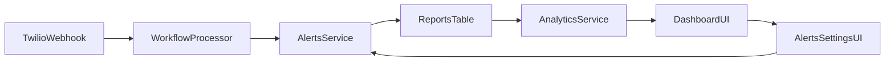

# Dashboard v1 Specification Implementation Plan (MPBC-first)

## Goals (per spec)

- **Operational dashboard**: at-a-glance “what / where / urgent” for org admins.
- **Backend-derived truth**: all metrics + severity computed server-side.
- **Org-aware**: org scoped by default; **super_admin can switch org**.
- **MPBC-first, org-agnostic**: MPBC labels/metrics OK, but data model/components must stay generic.

## What already exists (we will reuse)

- **Dashboard page + filters**: `/dashboard` already has **org selector** (super admin) + **7d/30d** range (`src/app/dashboard/page.tsx`).
- **Widgets already implemented**:
- Cards: `src/app/dashboard/_components/stats-cards.tsx`
- Line chart: `src/app/dashboard/_components/trend-chart.tsx`
- Donut chart: `src/app/dashboard/_components/pest-distribution.tsx`
- Activity feed: `src/app/dashboard/_components/recent-activity.tsx`
- Map (Leaflet): `src/app/dashboard/_components/dashboard-map.tsx`
- **Backend aggregation layer**: `src/server/api/routers/analytics.ts` + `src/server/modules/analytics/analytics-service.ts`.
- **WhatsApp ingestion**: `src/server/modules/whatsapp-bot/workflow-processor.ts` persists reports with `label` (MPBC uses `pest_name`) and `dataPayload` (MPBC uses numeric `count`).

## Key architectural change: introduce “Severity” (ops alerting)

### Data flow (high-level)

### 1) Database schema & migration

**Files:**

- [`/Users/mohara/Documents/aakitech/Saas/agridata/src/server/db/schema.ts`](/Users/mohara/Documents/aakitech/Saas/agridata/src/server/db/schema.ts)
- New Drizzle migration under [`/Users/mohara/Documents/aakitech/Saas/agridata/drizzle/`](/Users/mohara/Documents/aakitech/Saas/agridata/drizzle/)

**Add:**

- **Enum** `severityEnum`: `NORMAL | WARNING | HIGH`.
- **Column** on `reports`: `severity` (nullable initially for existing data).
- **(Recommended)** Column `observedCount` (integer, nullable) for fast, reliable severity computation/queries.
- **New table** `org_alert_thresholds` (name flexible), org-level per-pest thresholds:
- `id` (uuid)
- `orgId` (fk)
- `pestKey` (text) – store normalized pest name (e.g. "Moth")
- `normalMax` (int)
- `warningMax` (int)
- `highMin` (int) – or derive as `warningMax + 1` (choose one representation and enforce invariants)
- `createdAt`, `updatedAt`
- unique index on `(orgId, pestKey)`

**Why a table**: clean, scalable across orgs/pests and keeps `organizations.workflowConfig` reserved for bot flows.

### 2) Alerts module (business logic)

**New module:**

- [`/Users/mohara/Documents/aakitech/Saas/agridata/src/server/modules/alerts/alerts-service.ts`](/Users/mohara/Documents/aakitech/Saas/agridata/src/server/modules/alerts/alerts-service.ts)

**Responsibilities:**

- `getThresholds(orgId)`
- `upsertThreshold(orgId, pestKey, thresholds)`
- `computeSeverity({ orgId, pestKey, value }): 'NORMAL' | 'WARNING' | 'HIGH'`
- Default behavior if no config found: `NORMAL`.
- Enforce invariants server-side (e.g., `normalMax < warningMax < highMin` or compute `highMin = warningMax + 1`).

### 3) Alerts router (thin)

**New router:**

- [`/Users/mohara/Documents/aakitech/Saas/agridata/src/server/api/routers/alerts.ts`](/Users/mohara/Documents/aakitech/Saas/agridata/src/server/api/routers/alerts.ts)

**Procedures:**

- `getOrgThresholds({ orgId? })`
- org_admin: ignores `orgId` and returns own org thresholds.
- super_admin: requires `orgId` or returns empty/first org (choose explicit behavior).
- `upsertOrgThreshold({ orgId?, pestKey, normalMax, warningMax, highMin? })`
- org_admin: own org only.
- super_admin: target org via `orgId`.

**Register in:**

- [`/Users/mohara/Documents/aakitech/Saas/agridata/src/server/api/root.ts`](/Users/mohara/Documents/aakitech/Saas/agridata/src/server/api/root.ts)

### 4) Compute `severity` at ingestion time (no retroactive recalculation)

**Update:**

- [`/Users/mohara/Documents/aakitech/Saas/agridata/src/server/modules/whatsapp-bot/workflow-processor.ts`](/Users/mohara/Documents/aakitech/Saas/agridata/src/server/modules/whatsapp-bot/workflow-processor.ts)

**Implementation approach:**

- Extract:
- `pestKey`: from `computedData.pest_name` (MPBC), else fall back to `computedData.label` / saved `label`.
- `observedCount`: from `computedData.count` (MPBC), else fall back to other numeric field(s) per workflow.
- Call `AlertsService.computeSeverity(...)` and persist `reports.severity` (and `reports.observedCount` if added).
- Do **not** update existing past reports when thresholds change.

## Dashboard API alignment (org + time range applied everywhere)

### 5) Update AnalyticsService to be severity-aware and range-scoped

**Update:**

- [`/Users/mohara/Documents/aakitech/Saas/agridata/src/server/modules/analytics/analytics-service.ts`](/Users/mohara/Documents/aakitech/Saas/agridata/src/server/modules/analytics/analytics-service.ts)

**Changes:**

- Accept `range: '7d' | '30d'` for:
- `getStats`
- `getPestDistribution`
- `getRecentReports`
- `getMapPoints`
- Update definitions to match spec:
- **Total Reports**: all-time (org-scoped)
- **Reports This Period**: count within selected range
- **Active Scouts**: distinct officers with ≥1 report in selected range
- **High Alert Reports**: count of reports with `severity = HIGH` in selected range
- Update distribution:
- Group by **pest** (use `reports.label`, since MPBC comes from bot)
- Include reports in selected range (not only VERIFIED)
- Update map points to return fields required by spec:
- `pest` (label)
- `severity`
- `createdAt`
- `officerName` (join `appUsers.fullName/phone`)

### 6) Update Analytics router inputs/outputs

**Update:**

- [`/Users/mohara/Documents/aakitech/Saas/agridata/src/server/api/routers/analytics.ts`](/Users/mohara/Documents/aakitech/Saas/agridata/src/server/api/routers/analytics.ts)

**Changes:**

- Add `range` input to endpoints that currently don’t take it.
- Keep routers thin; all logic stays in `AnalyticsService`.

*(Optional optimization later: a single `getDashboardSnapshot` endpoint to fetch all widgets in one round-trip.)*

## Frontend updates (match spec + improve reliability)

### 7) Dashboard page: pass filters to all widgets and update copy

**Update:**

- [`/Users/mohara/Documents/aakitech/Saas/agridata/src/app/dashboard/page.tsx`](/Users/mohara/Documents/aakitech/Saas/agridata/src/app/dashboard/page.tsx)

**Changes:**

- Ensure `range` is passed to **stats**, **distribution**, **activity**, and **map points** queries.
- Rename page title from “Analytics Dashboard” to “Dashboard” (operational framing).

### 8) Summary metric cards (remove out-of-scope trends)

**Update:**

- [`/Users/mohara/Documents/aakitech/Saas/agridata/src/app/dashboard/_components/stats-cards.tsx`](/Users/mohara/Documents/aakitech/Saas/agridata/src/app/dashboard/_components/stats-cards.tsx)

**Changes:**

- Replace week trend UI with the four v1 metrics (no deltas).
- Update labels to match chosen definitions:
- Total Reports (All time)
- Reports This Period (7d/30d)
- Active Scouts
- High Alert Reports

### 9) Recent activity: add severity badge

**Update:**

- [`/Users/mohara/Documents/aakitech/Saas/agridata/src/app/dashboard/_components/recent-activity.tsx`](/Users/mohara/Documents/aakitech/Saas/agridata/src/app/dashboard/_components/recent-activity.tsx)

**Changes:**

- Include `severity` in the data returned by the API and display as a badge.

### 10) Map stability + satellite toggle

**Update:**

- [`/Users/mohara/Documents/aakitech/Saas/agridata/src/app/dashboard/_components/dashboard-map.tsx`](/Users/mohara/Documents/aakitech/Saas/agridata/src/app/dashboard/_components/dashboard-map.tsx)
- [`/Users/mohara/Documents/aakitech/Saas/agridata/next.config.js`](/Users/mohara/Documents/aakitech/Saas/agridata/next.config.js)

**Changes:**

- **Fix CSP**: current `img-src` only allows `self`, `data:`, `blob:`, `https://*.supabase.co`.
- Add tile sources for:
    - Standard: `https://*.tile.openstreetmap.org`
    - Satellite (no API key): `https://server.arcgisonline.com`
- Add Twilio media fallback domain for inconsistent image loading: `https://api.twilio.com` (since workflow falls back to `MediaUrl0` on upload failure).
- **Local marker icons**: stop loading marker icons from `unpkg.com` (blocked by CSP); serve them from `/public/`.
- Add **map type toggle** using Leaflet layers control (Standard vs Satellite).
- Marker popup should show (per spec): pest, severity, date, officer name.

## Admin Settings → Alerts (org-level thresholds UI)

### 11) Create Alerts settings page

**New route (proposal):**

- [`/Users/mohara/Documents/aakitech/Saas/agridata/src/app/dashboard/settings/alerts/page.tsx`](/Users/mohara/Documents/aakitech/Saas/agridata/src/app/dashboard/settings/alerts/page.tsx)
- Route components in `src/app/dashboard/settings/alerts/_components/`

**Behavior:**

- org_admin: edits own org thresholds.
- super_admin: can select an org (reuse the existing org selector pattern).
- UI: simple table editor per pest:
- pest name
- normalMax
- warningMax
- highMin (or computed)
- save per row

### 12) Add navigation entry

**Update:**

- [`/Users/mohara/Documents/aakitech/Saas/agridata/src/app/dashboard/_components/sidebar-nav.tsx`](/Users/mohara/Documents/aakitech/Saas/agridata/src/app/dashboard/_components/sidebar-nav.tsx)

**Change:**

- Add a Settings/Alerts link for `org_admin` and `super_admin`.

## Testing & rollout checklist (pilot readiness)