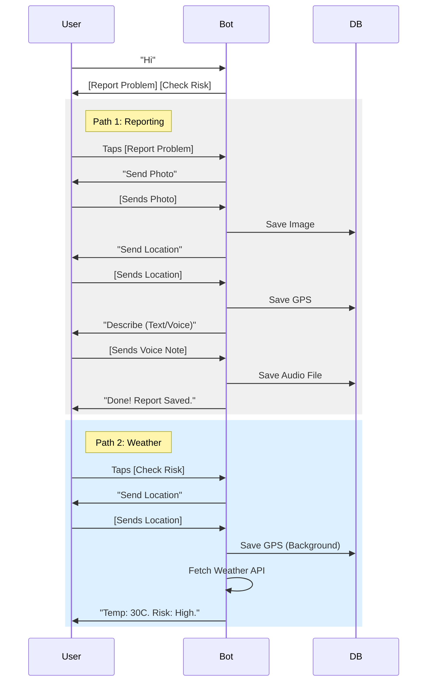

# AgriData AI: WhatsApp Bot Technical Specification
**Version:** 1.1.0 (Updated with Exact Flows)
**Context:** Ingestion Layer for the Pest & Disease Early Warning System.

## 1. Overview
This document defines the technical implementation of the AgriData AI WhatsApp Bot. The bot serves as the primary data ingestion channel for farmers to report pest and disease outbreaks. It acts as a "Triage" system, collecting structured data (Image, Location, Description) which is then queued for verification by Agronomists.

**Core Philosophy:** "One Input, One Screen." The bot uses a strict Conversational State Machine to guide users through the reporting process to avoid frustration and ensure data integrity.

## 2. Architecture & Tech Stack
- **Runtime:** Next.js (App Router) API Routes (Serverless).
- **Provider:** Twilio (WhatsApp Business API) or Meta Cloud API directly.
- **Database:** Supabase (PostgreSQL).
- **File Storage:** Supabase Storage (Buckets: `raw-reports`, `audio-descriptions`).
- **State Management:** Persisted in Postgres (`bot_sessions` table).

## 3. Database Schema Requirements
To support the state machine, we need two specific tables in Supabase.

### Table: `bot_users`
- `id` (UUID, Primary Key)
- `phone_number` (String, Unique, Indexed)
- `created_at` (Timestamp)

### Table: `bot_sessions`
- `user_id` (FK -> bot_users.id)
- `current_state` (Enum/String) - See Section 4.
- `draft_report_id` (FK -> reports.id, Nullable)
- `last_active` (Timestamp)
- `metadata` (JSONB) - Used to store temp data (e.g., `{"intent": "WEATHER"}`).

### Table: `reports`
- `id` (UUID)
- `user_id` (FK)
- `status` (Enum: DRAFT, PENDING_TRIAGE, VERIFIED, REJECTED)
- `category` (Enum: PEST, DISEASE, WEATHER)
- `media_url` (String) - Photo of the crop
- `audio_url` (String, Nullable) - Voice note URL
- `location` (PostGIS Geography Point)
- `description` (Text, Nullable) - Text description
- `created_at` (Timestamp)

## 4. The State Machine (Exact Logic)
The bot logic is a switch statement based on the user's `current_state`.

### Flow A: Main Menu & Routing

| State | Trigger | System Logic | Next State |
| :--- | :--- | :--- | :--- |
| **IDLE** | User sends "Hi" | 1. Check/Create User.<br>2. Send Menu Template.<br>**Header:** AgriData AI<br>**Body:** "Mhoro! I am your crop protection assistant. How can I help you today?"<br>**Buttons:**<br>1. Report Crop Problem<br>2. Check Local Risk | **AWAITING_MENU_CHOICE** |

### Flow B: Report Crop Problem (The Core Loop)

| State | Trigger | System Logic | Next State |
| :--- | :--- | :--- | :--- |
| **AWAITING_MENU_CHOICE** | Taps *Report Crop Problem* | 1. Create `reports` row (status: DRAFT).<br>2. Send: "Okay. Please send a Photo of the damaged plant. Close-ups of leaves or stems work best!" | **AWAITING_PHOTO** |
| **AWAITING_PHOTO** | Sends Image | 1. Upload to Supabase (`raw-reports`).<br>2. Update Report `media_url`.<br>3. Send Location Request.<br>**Body:** "Received! Now, where is this field? Tap the button below to share your current location." | **AWAITING_LOCATION** |
| **AWAITING_PHOTO** | Sends Text | Send: "I need a photo first so our experts can see the problem. Please tap the camera icon." | **AWAITING_PHOTO** |
| **AWAITING_LOCATION** | Sends Location | 1. Save Lat/Long to `reports`.<br>2. Check `metadata.intent`. If "WEATHER", go to Flow C.<br>3. Else (Reporting), Send: "Got it. Finally, describe what is happening. You can type a message or send a Voice Note." | **AWAITING_DESCRIPTION** |
| **AWAITING_DESCRIPTION** | Sends Text | 1. Update `reports.description`.<br>2. Set status = PENDING_TRIAGE.<br>3. Send: "Thank you! Report #[ID] saved. We will notify you if an alert is issued." | **IDLE** |
| **AWAITING_DESCRIPTION** | Sends Audio | 1. Upload to Supabase (`audio-descriptions`).<br>2. Update `reports.audio_url`.<br>3. Set status = PENDING_TRIAGE.<br>4. Send: "Voice note received! Report #[ID] saved." | **IDLE** |

### Flow C: Check Local Risk (The "Give")

| State | Trigger | System Logic | Next State |
| :--- | :--- | :--- | :--- |
| **AWAITING_MENU_CHOICE** | Taps *Check Local Risk* | 1. Set `metadata.intent` = "WEATHER".<br>2. Send Location Request.<br>**Body:** "To check the risk in your area, I need your location. Tap the button below." | **AWAITING_LOCATION** |
| **AWAITING_LOCATION** | Sends Location | ...Location Saved (Shared Logic)...<br>1. Check `metadata.intent` == "WEATHER".<br>2. Call Open-Meteo API with Lat/Long.<br>3. Generate Risk Text.<br>4. Send: "📍 Forecast for [Ward]<br>🌡️ Temp: 28°C (Hot)<br>⚠️ Risk: High heat favors Aphids. Scout your fields!" | **IDLE** |

## 5. API Implementation Details

### Handling Media (Images & Audio)
- **Audio Strategy:** For MVP, do not transcribe. Store the `.ogg` or `.aac` file from WhatsApp directly into Supabase.
- **Playback:** The Admin Dashboard will have a simple HTML5 Audio Player `<audio src="{audio_url}" />` for the Agronomist to listen to the report.

### Twilio Location Request Code Snippet
The "Send Location" button is a special type.

```javascript
// Function to send Location Request Button
const message = twiml.message();
message.content({
  contentSid: 'HXb5b62575e6e4...', // If using Content Template
  // OR use standard location request attributes if supported by your adapter
});
// Note: For standard TwiML, location requests are often just text instructions 
// because the "Location Request Button" is a specific WhatsApp UI element. 
// Standard text fallback:
message.body("Please tap the 📎 (Paperclip) > Location > 'Send Your Current Location'.");
```

*Note: If using the Twilio Content API (Templates), use a "Quick Reply" or "Call to Action" template, but WhatsApp native "Location Request" messages are often restricted to specific business categories. The fallback instruction (Paperclip > Location) is 100% reliable.*

## 6. Visual Flow (Mermaid)


