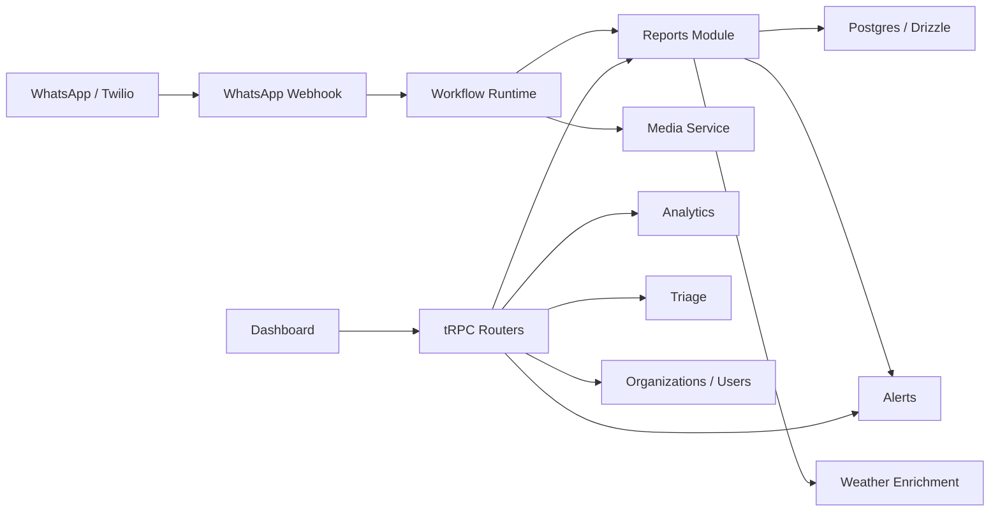

# Architecture

**Status:** Current  
**Last Updated:** June 2, 2026

AgriData AI is a multi-tenant agricultural surveillance platform. Field reports enter through WhatsApp, are stored as structured reports with media and location, and are surfaced through a dashboard for analytics, triage, reporting, and partner operations.

## Current Stack

- Next.js App Router
- React
- tRPC
- PostgreSQL on Supabase
- Drizzle ORM
- Supabase Auth and Storage
- Twilio WhatsApp
- PostHog for observability and feature flags
- Vitest for emerging automated tests

## System Shape

## Core Code Areas

- `src/app/api/webhooks/whatsapp/route.ts`: Twilio webhook entry point.
- `src/server/modules/whatsapp-bot/`: WhatsApp state and workflow processing.
- `src/server/modules/reports/`: report creation, reporting utilities, and PDF rendering.
- `src/server/modules/alerts/`: severity and alert-related logic.
- `src/server/modules/analytics/`: dashboard aggregations and map/report summaries.
- `src/server/modules/triage/`: report review and enhancement workflows.
- `src/server/modules/weather/`: asynchronous weather enrichment.
- `src/server/modules/media/`: report image/media handling.
- `src/server/api/routers/`: thin tRPC API layer.
- `src/server/db/schema.ts`: Drizzle schema and core data model.
- `src/app/dashboard/`: dashboard surfaces.

## Engineering Principles

- Keep tRPC routers thin. Put business rules in `src/server/modules/*`.
- Keep organization scoping explicit in services and routers.
- Treat WhatsApp ingestion as reliability-critical; do not block report creation on enrichment, analytics, or advisory side effects.
- Prefer configurable organization workflows over hard-coded partner assumptions.
- Treat alerts, triage, advisory, and outbound communication as separate domains even when they share report data.
- Add feature flags for experimental or high-risk dashboard behavior.
- Keep prototype work behind `/dashboard/lab`, feature flags, role gates, and mock data until promoted.

## Codebase Health

- [Testing Strategy](testing-strategy.md)
- [Branching and Release](branching-and-release.md)
- [Deployment and release docs](deployment-and-release/)

## Related Product Docs

- [Product overview](../product/overview.md)
- [Multi-tenant onboarding roadmap](../product/roadmaps/multi-tenant-onboarding-readiness.md)
- [Kutsaga Track A roadmap](../product/roadmaps/kutsaga-track-a-whatsapp-pilot.md)

